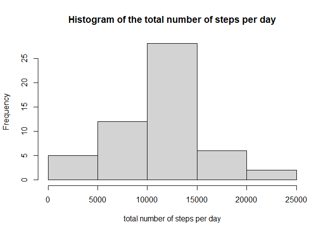
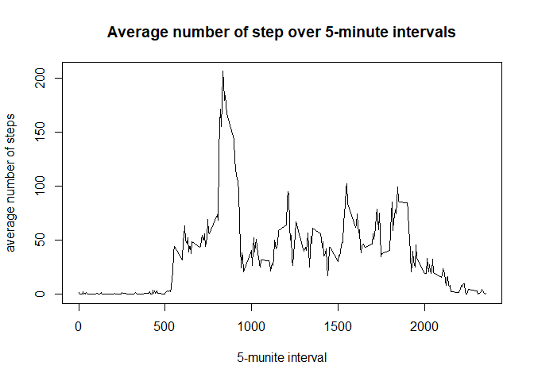
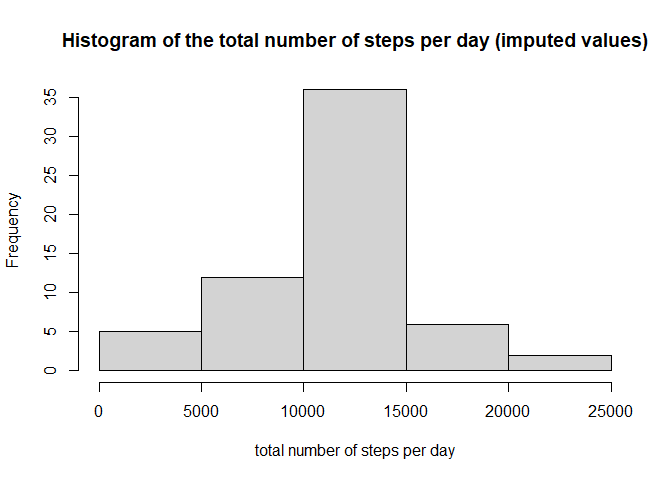
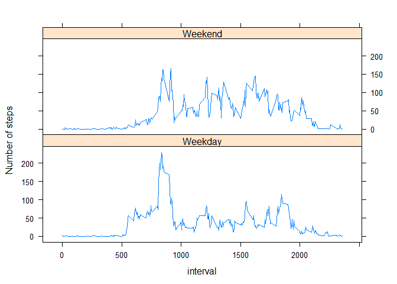

## Loading and preprocessing the data
 
To load our data data set, we use the following code:  


```r
Dir_file <- "D:/PhD WORKS/DS/Coursera/Reroducible research/Week 2/Project/RepData_PeerAssessment1/activity.zip"
file.name <- unzip(Dir_file)
# loading the data set
dataset <- read.csv(file.name, header = TRUE)
library(lubridate)
```

```
## 
## Attaching package: 'lubridate'
```

```
## The following objects are masked from 'package:base':
## 
##     date, intersect, setdiff, union
```

```r
dataset$date <- ymd(dataset$date)
```

The `Dir_file` variable contains the location of the zipped file and the variable `file.name` contains the directory of the unzipped file where is located our data set named **activity**. We apply the function **ymd()** of the package _lubridate_ to transform the variable date in our data set into a variable of class _**date**_. 

## What is mean total number of steps taken per day?

### Histogram of the total number of steps

To build the histogram of the total number of steps taken each day, we agrregate the variable step in our data set into date and keep the outcome into a variable named `total_step`. We then use the function **hist** to build the histogram.


```r
# Total number of steps per day
total_step <- aggregate(steps ~ date, dataset, sum,  na.action = na.omit)
hist(total_step$steps, xlab = "total number of steps per day", 
     main = "Histogram of the total number of steps per day")
```

<!-- -->

### Mean and median nummber of steps taken each day

To compute the mean (variable `m`) and the median (variable `med`), we use, respectively, the **mean()** function and the **median** function.  


```r
m <- mean(total_step$steps, na.rm = TRUE)
print(c("the mean number of steps: ",m))
```

```
## [1] "the mean number of steps: " "10766.1886792453"
```

```r
med <- median(total_step$steps, na.rm = TRUE)
print(c("the median number of steps: ",med))
```

```
## [1] "the median number of steps: " "10765"
```

## What is the average daily activity pattern?

### Time series plot

We aggregate the data set into intervals to plot the time series of the average number of steps taken.


```r
average_step <- aggregate(steps ~ interval, data = dataset, mean, na.action = na.omit)
plot(average_step$interval, average_step$steps, type = "l", 
     xlab = "5-munite interval", ylab = "average number of steps",
     main = "Average number of step over 5-minute intervals")
```

<!-- -->

### Interval with the maximum number of steps


The interval with the maximum number of steps is giving by the following code:


```r
maximum_interval <- average_step$interval[which.max(average_step$steps)]
print(c("the interval with the maximum number of steps: ",maximum_interval))
```

```
## [1] "the interval with the maximum number of steps: "
## [2] "835"
```
## Imputing missing values

### Total number of NA

The total number of missing value in our data set is recorded in the variable `total_NA`.


```r
total_NA <- sum(is.na(dataset$steps))
print(c("the total number of missing values: ",total_NA))
```

```
## [1] "the total number of missing values: "
## [2] "2304"
```

### Imputation

The imputation of the missing values is based on the following strategy: _**Missing value for a particular interval is filled with the mean for that 5-munite interval**_. `new_dataset` is the new dataframe with missing values filled in.


```r
# imputing missing values
# Missing value for an interval = to the mean for that 5-munite interval

newdata <- merge(dataset, average_step, by = "interval")
for (i in 1:length(newdata$steps.x)) { 
        if (is.na(newdata$steps.x[i])){ newdata$steps.x[i] <- newdata$steps.y[i]}
}
new_dataset <- data.frame(steps = newdata$steps.x, date = newdata$date, 
                          interval = newdata$interval)
```

### Histogram with the new dataframe

After aggregating the data into days, we build the histogram with the new data set.


```r
total_step_imp <- aggregate(steps ~ date, new_dataset, sum)
hist(total_step_imp$steps, xlab = "total number of steps per day", 
     main = "Histogram of the total number of steps per day (imputed values)")
```

<!-- -->

### Mean and median


```r
m_imp <- mean(total_step_imp$steps)
print(c("the mean number of steps: ",m_imp))
```

```
## [1] "the mean number of steps: " "10766.1886792453"
```

```r
med_imp <- median(total_step_imp$steps)
print(c("the median number of steps: ",med_imp))
```

```
## [1] "the median number of steps: " "10766.1886792453"
```

### Comparaison

Comparing the mean and the median. There is not a big difference between the two.


```r
compare <- rbind(summary(total_step$steps)[3:4],
                 summary(total_step_imp$steps)[3:4])
rownames(compare) <- c("With NA's", "Without NA's")
print(compare)
```

```
##                Median     Mean
## With NA's    10765.00 10766.19
## Without NA's 10766.19 10766.19
```

## Are there differences in activity patterns between weekdays and weekends?

We first add a new factor variable that has two levels: _weekday_ and _weekend_.


```r
new_dataset$weekdays <- weekdays(new_dataset$date)
new_dataset$weekend <- new_dataset$weekdays %in% c("samedi", "dimanche")
new_dataset$weekend <- factor(x = as.character(new_dataset$weekend),
                              levels = c("FALSE", "TRUE"),
                              labels = c("Weekday", "Weekend"))
```

We then plot our time series data. We can observed a difference in the average number of step during weekdays and during weekends.


```r
library(lattice)
average_step_week <- aggregate(steps ~ interval + weekend, new_dataset, mean)
xyplot(steps ~ interval | weekend, data = average_step_week, layout= c(1,2),
       type = "l", ylab = "Number of steps")
```

<!-- -->


